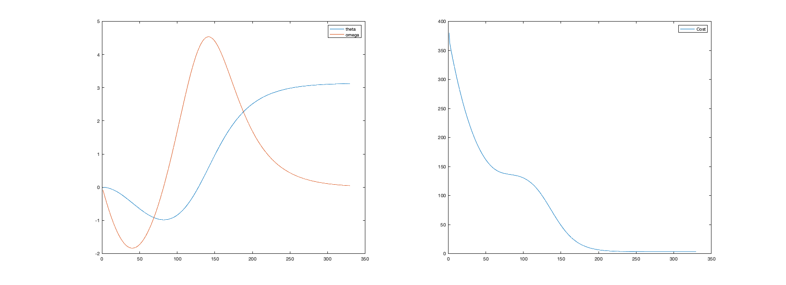
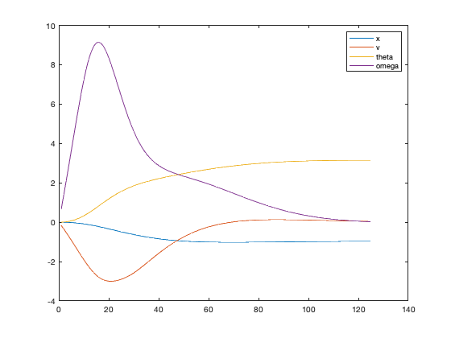
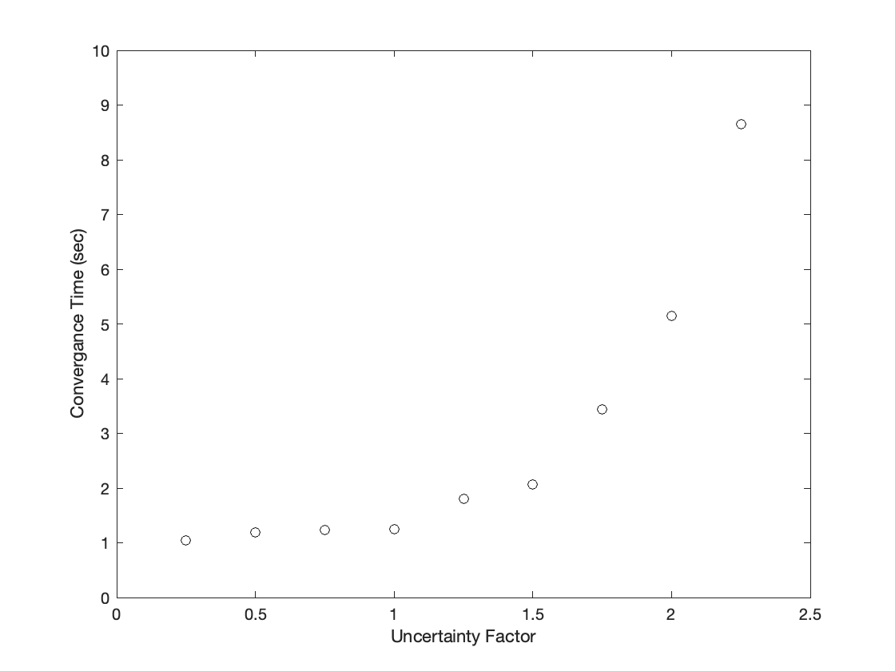
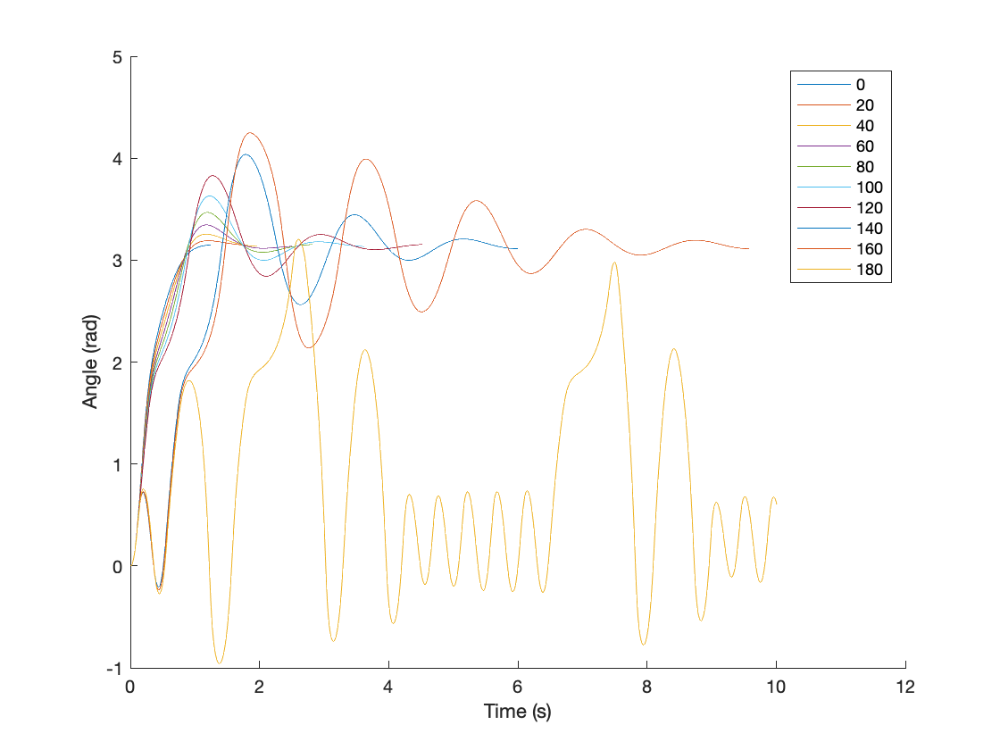
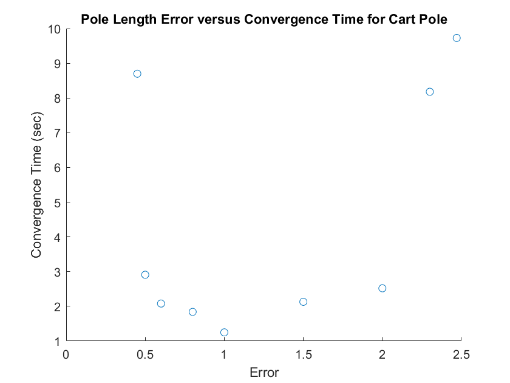
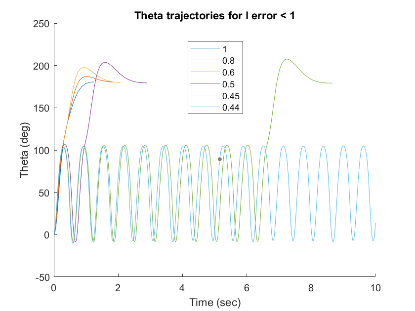
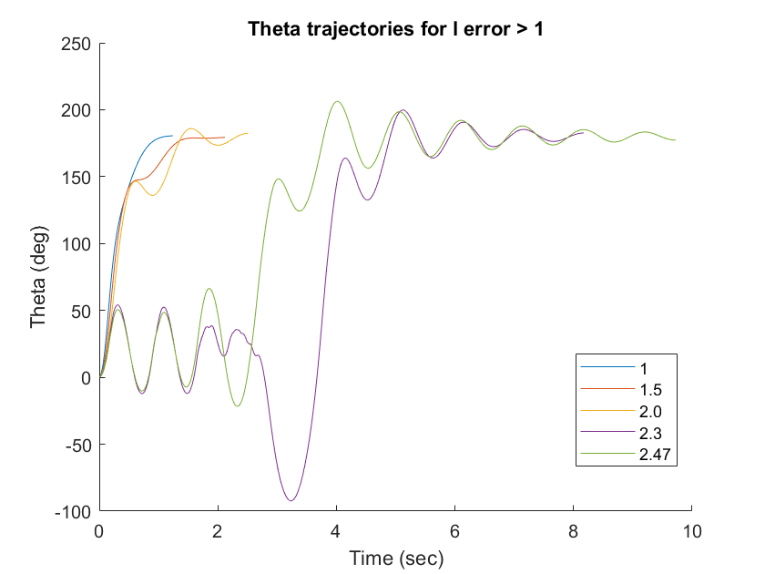

# Model Predictive Control

This document document details the implementation of model predictive control using Differential Dynamic Programming. A brief overview of the implementation is provided, and the model is implemented for two systems, an inverted pendulum and a cart-pole. 

##### Keywords: 

Model Predictive Control, Inverted Pendulum, Cart-Pole

## MPC Algorithm 
The following pseudo-code describes the implementation of Differential Dynamic Programming with Model Predictive Control. 

| Steps | Description | 
| ----- | ----------- | 
| 1 | Perform DDP to obtain optimal control $u^*$ | 
| 2 | Update the dynamics with the current state and the first control value in $u^*$, and obtain the next state | 
| 3 | Update the current state with the values from step 2 | 
| 4 | Repeat until converged | 

## Implimentation 

### Inverted Pendulum Results 

The following results show the performance of the MPC algorithm for the inverted pendulum case. Here, the objective was to bring the angle from an initial state of 0 degrees to a final state of 180 degrees. The system responds in a similar manner to the case where only DDP was used. Both responses experience some oscillations before reaching the target state. One notable difference that should be mentioned is that the cost with MCP-DDP takes longer to converge, while in the DDP cause the cost converges much quicker. 

### Cart-Pole Results 

The following results shows the performance of the MPC algorithm for the cart-pole case. With a similar objective of getting the final angle to 180 degrees and all the other states to zero. The system responds much quicker here (no oscillations) primarily because the time horizon was set to 0.5 seconds and the controls were weighted heavily. If the time horizon is increased, the system begins to oscillate much more, like the response seen in just the DDP case (which had a higher time horizon). This is because the controls become "lazy" in that the DDP algorithm that is called at each time step optimizes for reaching the target state in a constant amount of time. Similarly, reducing the weight of the controls also produces more oscillations in the response, as the controls become more liberal and the system becomes less stable. The weight in the controls became the most important parameter to tune since changing time horizon and the number of iterations affected the computation time most of all, and affected the stability of the system minimally.  

## Uncertainties 

The robustness of MPC-DDP was studied with the cart-pole system. Uncertainties in the four system parameters, mass of the cart, mass of the pole, length of the pole, and the gravitational acceleration, were introduced to a "real" model (which is used to make the one step ahead propagations). These uncertainty values were multiplied by the values of the parameters that the DDP algorithm trained on to represent a discrepancy in the model of the dynamics. The resulting system response was recorded and presented here. Note for each case, the MPC-DDP algorithm was set to run to t = 10 seconds. This was chosen based on the low convergence time of the system to no uncertainties in any of the parameters (approximately 1.25 seconds) and the need to be able to simulate a large amount of simulations.

### Uncertainties in Mass of the Cart 

Based on the figure below, the system fails to converge to the target state within ten seconds if the uncertainty factor in the mass of the
cart is greater than or equal to 2.5. The lower bound for the uncertainty in the mass lies between 0 and 0.1. A more detailed
value could not be found as the DDP algorithm breaks down. Figure 4 details the variation in the system response as the
uncertainty in the mass of the cart is increased. Initially, with low uncertainties the system experiences very little oscillations,
and converges very quickly (within 2 seconds). As the uncertainty grows, the systems begins to increasingly oscillate until it no
longer can converge to the target state within the designated 10 seconds.

**Convergence time as a function of the uncertainty factor for the mass of the cart.**

### Uncertainties in Mass of the Pole 

Based on the figures below, the system is capable of handling much more uncertainty in the mass of the pole. The maximum allowable uncertainty factor is 160, which is much higher than the maximum allowable uncertainty in the mass of the cart. Note the system also converges to cases where the uncertainty factor is 0 (i.e. mass of the pole is zero). This is likely because the mass of pole is originally a small value of 0.01 kg so increasing it or decreasing it by a percentage minimally affects the stability of the system. This may also explain why the MPC-DDP algorithm successfully converges when the mass of the pole is set to 0. As, the difference between 0 and 0.01 kg is so minute that it does not impact the system response significantly.

**Convergence time as a function of the uncertainty factor for the mass of the pole.**

**ystem response to different uncertainties in the mass of the pole.**

### Uncertainties in the Length of the pole

Based on the figures below, the system fails to converge for pole length error values less than 0.45 and greater than 2.5. Decreasing the length of the pole decreases the stability of the system, resulting in oscillations. This is because with a shorter length, the mass of the pole applies less torque to the system, and the control becomes more prevalent. Increasing the length of the pole does not prevent the system from converging to the final state, it just results in a larger convergence time. If increased further, it will likely exhibit similar behavior to increasing the mass of the pole, since both increase the moment the pole exerts on the cart. 

**Convergence time as a function of the uncertainty factor for the length of the pole case.**

**System response to a decreasing pole length error value.**

**System response to a increasing pole length error value.** 

